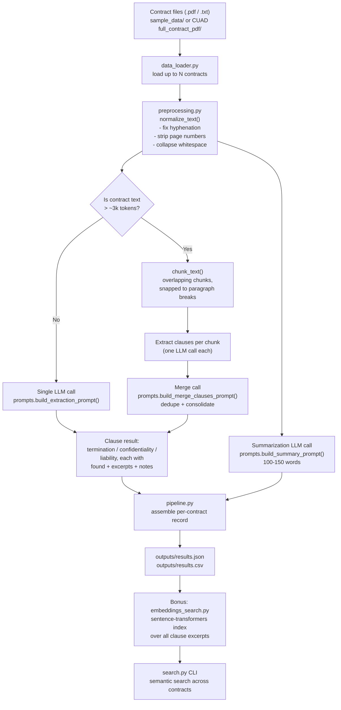

# CUAD Contract Clause Extraction & Summarization Pipeline

An LLM-powered pipeline that extracts termination, confidentiality, and
liability clauses from legal contracts and generates concise summaries,
built against the [CUAD (Contract Understanding Atticus Dataset)](https://www.atticusprojectai.org/cuad).

## Contents

```
cuad_pipeline/
├── main.py                    # CLI entry point: run the full pipeline
├── search.py                  # Bonus CLI: semantic search over extracted clauses
├── requirements.txt
├── .env.example                # Copy to .env and fill in your API key
├── sample_data/                # 3 small synthetic contracts for a quick smoke test
├── sample_outputs/              # Example results.json/csv (generated in mock mode) so you can see the expected shape without running anything
├── outputs/                    # results.json / results.csv land here when you run main.py
└── src/
    ├── data_loader.py          # Load contracts from PDF/txt
    ├── preprocessing.py        # Text normalization + chunking
    ├── prompts.py               # Prompt templates (incl. few-shot examples)
    ├── llm_extractor.py         # Groq API calls: extraction + summarization
    ├── embeddings_search.py      # Bonus: semantic search over clauses
    └── pipeline.py               # Orchestration
```

## 1. Setup

```bash
git clone <this-repo-url>
cd cuad_pipeline
python -m venv .venv && source .venv/bin/activate   # optional but recommended
pip install -r requirements.txt

cp .env.example .env
# edit .env and set GROQ_API_KEY=gsk_...
```

You need a Groq API key ([console.groq.com/keys](https://console.groq.com/keys) —
free to create, with a generous free tier) to run real extraction/
summarization. If you just want to sanity-check the
pipeline mechanics without spending API credits, set `USE_MOCK_LLM=true` in
`.env` — this swaps in a deterministic canned response so every stage (load →
normalize → chunk → "extract" → "summarize" → write CSV/JSON) still runs
end-to-end.

> **Note**
>
> This project supports two execution modes:
>
> **Live Mode (`USE_MOCK_LLM=false`)**
> - Performs real LLM-powered clause extraction and contract summarization using the configured Groq model.
> - Requires a valid `GROQ_API_KEY`.
>
> **Mock Mode (`USE_MOCK_LLM=true`)**
> - Executes the complete document-processing pipeline without making external API calls.
> - Returns deterministic mock responses that preserve the same output structure as Live Mode.
> - Intended for local development, UI testing, demonstrations, and environments where API credentials are unavailable or usage quotas have been reached.
>
> Both modes share the same preprocessing, chunking, pipeline orchestration, and output formats (`results.json` and `results.csv`), ensuring consistent application behavior across development and production environments.

## Execution Modes

The pipeline can be executed in either Live Mode or Mock Mode depending on the development scenario.

### Live Mode

Configure your API key in the `.env` file:

```env
GROQ_API_KEY=<your_api_key>
USE_MOCK_LLM=false
```

Run the pipeline or Streamlit application normally to generate real contract summaries and clause extractions.

### Mock Mode

For demonstrations, testing, or offline development:

```env
USE_MOCK_LLM=true
```

Mock Mode bypasses external API calls while executing the entire pipeline, allowing the application to produce deterministic outputs that match the expected schema. This enables end-to-end validation of preprocessing, clause extraction flow, result generation, CSV/JSON export, and the Streamlit interface without consuming API credits.

## 2. Getting the CUAD data

This repo ships with 3 small synthetic sample contracts in `sample_data/` so
you can run the pipeline immediately with no download. To run against the
actual CUAD dataset:

1. Download `CUAD_v1.zip` from the [Atticus Project site](https://www.atticusprojectai.org/cuad)
   or the [TheAtticusProject/cuad GitHub releases](https://github.com/TheAtticusProject/cuad).
2. Unzip it — it contains a `full_contract_pdf/` folder (original PDFs, organized
   by contract category) and a `CUAD_v1_master_clauses.csv` (human clause
   annotations, useful for evaluation but not required to run the pipeline).
3. Point `--data_dir` at that folder (or a subfolder with ~50 contracts you've
   copied out, per the assignment's "50 contract subset" scope):

```bash
python main.py --data_dir /path/to/CUAD_v1/full_contract_pdf --output_dir outputs --n_contracts 50
```

The loader (`src/data_loader.py`) accepts a mix of `.pdf` and `.txt` files and
will use CUAD's pre-extracted `.txt` version of a contract over the `.pdf`
when both are present (cleaner, faster, no PDF-parsing artifacts).

## 3. Running the pipeline

```bash
python main.py --data_dir sample_data --output_dir outputs --n_contracts 50
```

Options:

| Flag              | Default         | Description                                         |
| ----------------- | --------------- | --------------------------------------------------- |
| `--data_dir`    | `sample_data` | Folder with contract`.pdf`/`.txt` files         |
| `--output_dir`  | `outputs`     | Where`results.json` / `results.csv` are written |
| `--n_contracts` | `50`          | Max number of contracts to process                  |
| `--verbose`     | off             | Debug logging                                       |

Output schema (`results.json` / `results.csv`), matching the assignment spec:

```json
{
  "contract_id": "sample_msa_001",
  "filename": "sample_msa_001.txt",
  "summary": "100-150 word plain-English summary...",
  "termination_clause": {"found": true, "excerpts": ["..."], "notes": "..."},
  "confidentiality_clause": {"found": true, "excerpts": ["..."], "notes": "..."},
  "liability_clause": {"found": true, "excerpts": ["..."], "notes": "..."}
}
```

The CSV mirrors this but flattens each clause object into a single readable
string cell (`notes` + verbatim excerpts), so it opens cleanly in Excel/Sheets.

## 4. Bonus: semantic search over clauses

After running `main.py` at least once (so `outputs/results.json` exists):

```bash
python search.py --results outputs/results.json --query "termination without cause" --top_k 5
```

This embeds every extracted clause excerpt with a local
`sentence-transformers` model (`all-MiniLM-L6-v2` — no extra API calls/cost)
and returns the most semantically similar excerpts across all processed
contracts, ranked by cosine similarity. Useful for questions that don't map
to an exact keyword, e.g. "which contracts cap liability at a fixed dollar
amount rather than a multiple of fees?"

## 5. Approach & architecture

### Flow diagram



### Design decisions

- **Structured JSON extraction, not free text.** Each clause type is
  extracted as `{found, excerpts, notes}` rather than a loose paragraph. This
  makes results directly consumable by downstream code (CSV export, semantic
  search index, evaluation against CUAD ground truth) without a fragile
  parsing layer, and it forces the model to be explicit about whether a
  clause is actually present versus just noting "not applicable" in prose.
- **Verbatim excerpts + separate paraphrase.** The prompt asks for exact
  quoted text in `excerpts` (so a reviewer can verify the extraction against
  the source) and a short paraphrase in `notes` (so a reader gets the gist
  without re-reading legalese). Conflating these tends to produce
  paraphrased "excerpts" that no longer match the source text.
- **One-shot example per clause type** (`prompts.FEW_SHOT_EXAMPLE`). A single
  worked example showing the expected JSON shape and excerpt granularity
  measurably reduces both false negatives (missing a clause because its
  wording doesn't match a keyword) and over-extraction (grabbing an entire
  section instead of the relevant sentences).
- **Chunking with overlap + paragraph snapping for long contracts.**
  Real-world contracts can exceed a single context window comfortably held
  alongside the prompt and few-shot example. `chunk_text()` splits on
  ~12k-character windows with 500-character overlap, snapped to the nearest
  paragraph break, so a clause spanning a page break isn't cut mid-sentence
  and isn't silently dropped between two chunks. Per-chunk results are then
  merged with a follow-up LLM call that deduplicates overlapping excerpts
  and writes one consolidated `notes` field, so the final output reads as a
  single coherent answer regardless of how many chunks the source document
  required.
- **Summarization truncates instead of chunking.** Termination/confidentiality/
  liability clauses can appear anywhere in a contract, so extraction must
  cover the whole document. A 100-150 word purpose/obligations/risk summary,
  by contrast, is almost always determinable from the first ~5k words
  (title, recitals, and core operative sections) — appendices and schedules
  at the end rarely change that summary, so truncating there instead of
  chunking-and-merging keeps summarization cheap and fast without a
  meaningful quality loss.
- **Mock LLM mode.** `USE_MOCK_LLM=true` swaps in a deterministic canned
  response so the full pipeline (load → normalize → chunk → extract →
  summarize → write CSV/JSON) can be smoke-tested with zero API calls. This
  is what was used to validate this repo end-to-end before wiring up a real
  key.
- **Retries only around the network call.** The `tenacity` retry wrapper
  sits around the actual `client.messages.create()` call (transient errors:
  rate limits, timeouts, 5xx), not around API-key validation — a missing key
  fails immediately with a clear message instead of retrying 5 times for a
  configuration error that will never resolve itself.

### Model choice

The pipeline defaults to [Groq](https://groq.com)'s hosted inference
(`GROQ_MODEL` env var, default `llama-3.3-70b-versatile`) via the official
`groq` Python SDK, which exposes an OpenAI-style chat completions API. Groq
was chosen over a paid provider like Anthropic/OpenAI because it has a free
tier and very low latency, which matters when processing 50 contracts with
several LLM calls each (extraction + summarization, plus chunk-merge calls
for long documents). Swapping in another provider (Anthropic, OpenAI, an
open-source model via vLLM/Ollama, etc.) only requires changing
`src/llm_extractor.py`'s `_get_client` / `_call_groq_api` functions —
`pipeline.py`, `prompts.py`, and the CLI are provider-agnostic.

## 6. Evaluating against CUAD's ground truth (optional)

`src/data_loader.load_master_clauses_csv()` loads CUAD's
`CUAD_v1_master_clauses.csv` and joins it to contracts by filename, if you
want to compare extracted excerpts against CUAD's human annotations (e.g.
token-overlap / ROUGE between your `excerpts` and CUAD's `Termination`
column) as a rough extraction-quality check. This is left as an extension
point rather than baked into `main.py`, since CUAD's annotation granularity
(clause-level spans) doesn't map 1:1 onto every clause type we extract.

## 7. Known limitations

- PDF text extraction (`pdfplumber`) can produce imperfect layout for
  multi-column contracts or scanned (image-only) PDFs; scanned PDFs would
  need an OCR pass first (not included here since CUAD's PDFs are
  digitally native, not scanned).
- Clause boundaries in real contracts are fuzzier than the synthetic
  examples in `sample_data/`; expect to iterate on `prompts.py`'s
  definitions/few-shot example against a batch of real CUAD contracts to
  tune excerpt granularity for your use case.
- The bonus semantic search downloads a small embedding model
  (`all-MiniLM-L6-v2`, ~80MB) from Hugging Face on first use — this
  requires outbound network access to `huggingface.co` once.
- When running in **Live Mode**, LLM inference depends on the configured provider's API availability and quota limits. If API usage limits are exceeded, the application can be switched to **Mock Mode** (`USE_MOCK_LLM=true`) to continue demonstrating the complete pipeline without external API calls.
